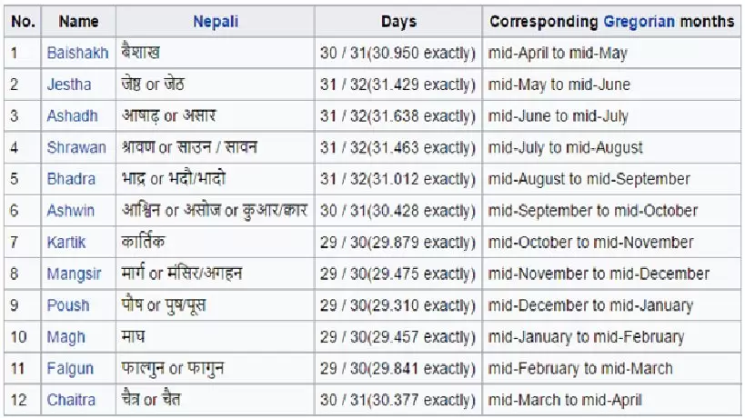
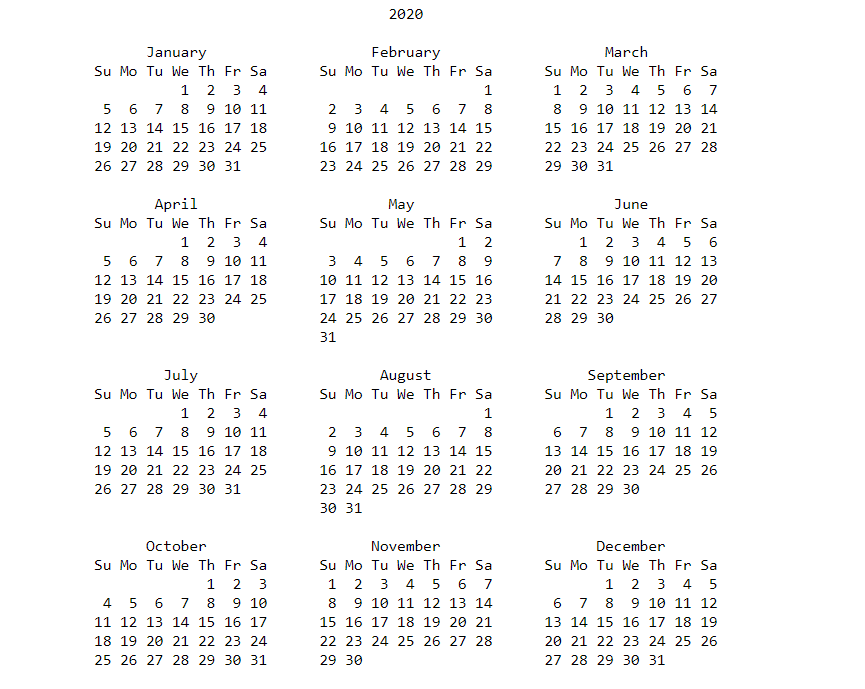

Nepali BS Calendar
- All in one package for nepali date (BS)

[Vikram Samvat](https://en.wikipedia.org/wiki/Vikram_Samvat) or Bikram Sambat B.S. and also known as the Vikrami calendar, is a Hindu calendar historically used in the South Asian subcontinent. Vikram Samvat is generally 57 years ahead of Gregorian Calendar, except during January to April, when it is ahead by 56 years. Alongside Nepal Sambat, it is one of the two official calendars used in Nepal. The traditional Vikram Samvat calendar, uses lunar months and solar sidereal years. The Nepali Bikram Sambat, introduced in 1901, also uses a solar sidereal year.

#### Terminology
- [Tithi](https://en.wikipedia.org/wiki/Tithi)
- [Panchang](https://en.wikipedia.org/wiki/Panchangam)
- [Vikram Samvat](https://en.wikipedia.org/wiki/Vikram_Samvat)
- [read more ...](./docs/README.md)

#### TODO
- add old and new dates in blank dates

#### Website
##### [necal-svelte](./example/necal-svelte/)

#### Reference
- [http://nepcal.com/index.php](http://nepcal.com/index.php)
- [https://codegino.com/blog/svelte-chromium-extension](https://codegino.com/blog/svelte-chromium-extension)